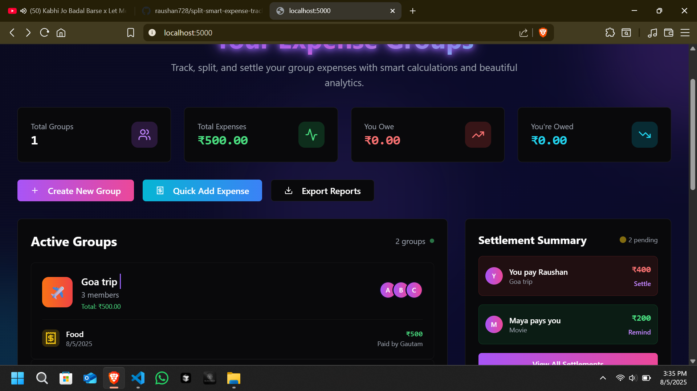
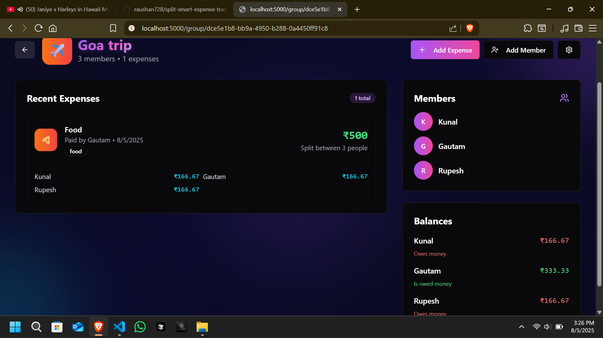
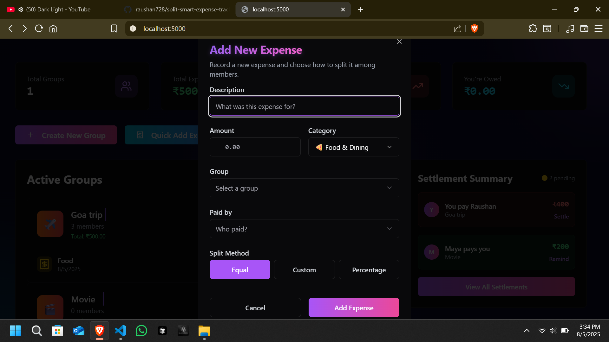
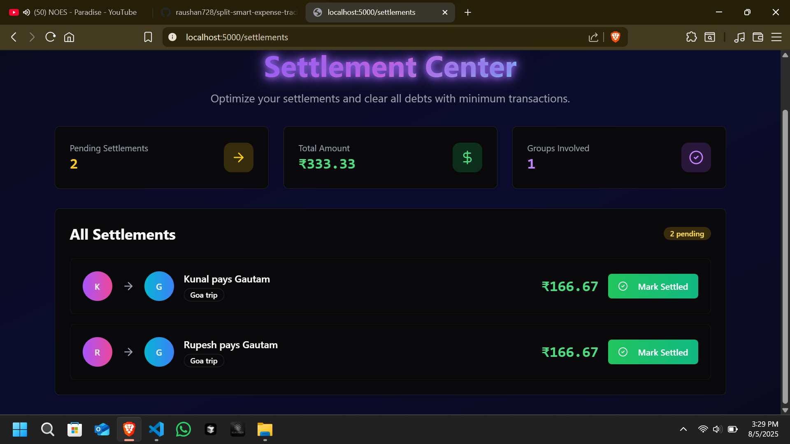
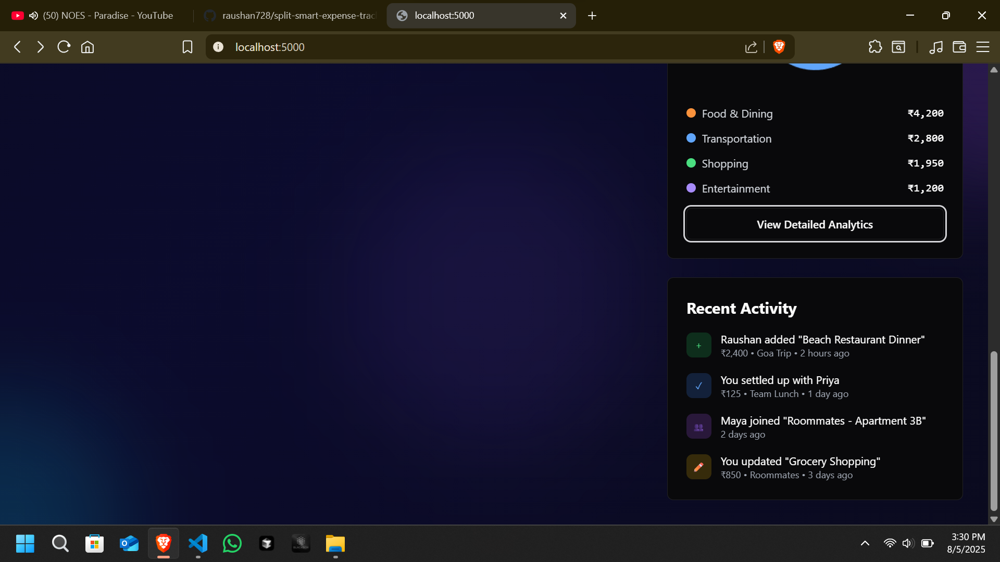
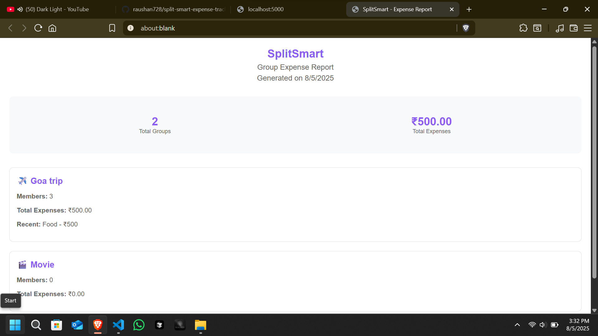

# SplitSmart Expense Tracker

A modern web application for tracking and splitting group expenses with intelligent settlement optimization.

## Table of Contents

- [Features](#features)
- [Technology Stack](#technology-stack)
- [Screenshots](#screenshots)
- [Getting Started](#getting-started)
- [Installation](#installation)
- [Usage](#usage)
- [API Documentation](#api-documentation)
- [Project Structure](#project-structure)
- [Development](#development)
- [Database Schema](#database-schema)
- [Contributing](#contributing)
- [License](#license)

## Features

### Core Functionality
- **Group Management**: Create and manage multiple expense groups
- **Member Management**: Add and remove group members with profile management
- **Expense Tracking**: Record expenses with categories and descriptions
- **Smart Splitting**: Automatic equal split calculations with custom options
- **Settlement Optimization**: Minimize transactions between members using advanced algorithms
- **Balance Tracking**: Real-time balance calculations for all group members
- **Multi-Currency Support**: Handle expenses in different currencies
- **Export Capabilities**: Export data to PDF and CSV formats

### User Experience
- **Responsive Design**: Optimized for desktop, tablet, and mobile devices
- **Dark Theme**: Modern glassmorphic design with gradient backgrounds
- **Real-time Updates**: Live synchronization across all connected devices
- **Intuitive Interface**: User-friendly design with clear navigation
- **Analytics Dashboard**: Visual expense breakdown with charts and insights

### Technical Features
- **Type Safety**: Full TypeScript implementation
- **Database Transactions**: ACID compliance for data integrity
- **Error Handling**: Comprehensive error management and user feedback
- **Performance Optimization**: Efficient data loading and caching
- **Security**: Input validation and sanitization

## Technology Stack

### Frontend
- **React 18** with TypeScript for component-based architecture
- **Wouter** for lightweight client-side routing
- **TanStack Query** for server state management and caching
- **Radix UI + shadcn/ui** for accessible, customizable components
- **Tailwind CSS** for utility-first styling
- **Vite** for fast development and optimized builds
- **Lucide React** for consistent iconography

### Backend
- **Node.js** with Express.js for server-side logic
- **TypeScript** for type-safe backend development
- **Drizzle ORM** for type-safe database operations
- **PostgreSQL** for robust data storage
- **Neon Database** for serverless PostgreSQL hosting

### Development Tools
- **ESLint** for code quality and consistency
- **Prettier** for code formatting
- **Husky** for Git hooks
- **TypeScript** for static type checking

## Screenshots

### Dashboard Overview

*Main dashboard showing all groups with expense summaries and quick actions*

### Group Details

*Detailed group view with member management, expense tracking, and balance calculations*

### Add New Expense

*Form for adding a new expense with smart splitting options*

### Settlement Center

*Overview of member balances and settlement recommendations*

### Recent Activity

*Log of recent expenses and settlements in the group*

### Export Report

*Options for exporting expense data as PDF or CSV*

## Getting Started

### Prerequisites
- Node.js 20.x or higher
- PostgreSQL database (Neon Database recommended)
- Git for version control

### Installation

1. **Clone the repository**
```bash
git clone https://github.com/raushan728/splitsmart-expense-tracker.git
cd splitsmart-expense-tracker
```

2. **Install dependencies**
```bash
npm install
```

3. **Environment Configuration**
Create a `.env` file in the root directory:
```env
DATABASE_URL=your_postgresql_connection_string
PORT=5000
NODE_ENV=development
```

4. **Database Setup**
```bash
npm run db:generate
npm run db:migrate
```

5. **Start Development Server**
```bash
npm run dev
```

The application will be available at `http://localhost:5000`

## Usage

### Creating Your First Group

1. **Access Dashboard**: Navigate to the main dashboard
2. **Create Group**: Click "Create New Group" button
3. **Group Setup**: Enter group name and select an icon
4. **Add Members**: Use the "Add Member" feature to invite participants
5. **Start Tracking**: Begin adding expenses and let SplitSmart handle the calculations

### Adding Expenses

1. **Navigate to Group**: Select your group from the dashboard
2. **Add Expense**: Click "Add Expense" button
3. **Enter Details**:
   - Description of the expense
   - Amount and currency
   - Category selection
   - Who paid for the expense
   - Split method (equal/custom)
4. **Save**: Confirm the expense entry

### Managing Settlements

1. **View Balances**: Check the balance section in group details
2. **Settlement Suggestions**: Review optimized settlement recommendations
3. **Mark as Settled**: Confirm payments between members
4. **Track History**: Monitor settlement history and patterns

### Exporting Data

1. **Select Group**: Choose the group you want to export
2. **Export Options**: Select PDF or CSV format
3. **Date Range**: Optionally filter by date range
4. **Download**: Generate and download your expense report

## API Documentation

### Base URL
```
http://localhost:5000/api
```

### Authentication
Currently uses header-based user identification:
```
x-user-id: your-user-id
```

### Core Endpoints

#### Groups
- `GET /groups` - Retrieve all groups for user
- `POST /groups` - Create new group
- `GET /groups/:id` - Get specific group details
- `PUT /groups/:id` - Update group information
- `DELETE /groups/:id` - Delete group

#### Members
- `POST /groups/:groupId/members` - Add member to group
- `DELETE /groups/:groupId/members/:memberId` - Remove member

#### Expenses
- `GET /groups/:groupId/expenses` - Get group expenses
- `POST /groups/:groupId/expenses` - Add new expense
- `PUT /expenses/:id` - Update expense
- `DELETE /expenses/:id` - Delete expense

#### Settlements
- `GET /groups/:groupId/settlements` - Get settlement recommendations
- `POST /settlements` - Mark settlement as completed

## Project Structure

```
splitsmart-expense-tracker/
├── client/                     # Frontend React application
│   ├── src/
│   │   ├── components/         # Reusable UI components
│   │   │   ├── ui/            # shadcn/ui components
│   │   │   ├── add-expense-modal.tsx
│   │   │   ├── add-member-modal.tsx
│   │   │   ├── create-group-modal.tsx
│   │   │   ├── expense-analytics.tsx
│   │   │   ├── group-settings-modal.tsx
│   │   │   ├── navbar.tsx
│   │   │   ├── settlement-summary.tsx
│   │   │   └── settlements-page.tsx
│   │   ├── hooks/             # Custom React hooks
│   │   ├── lib/               # Utility functions
│   │   │   ├── calculations.ts # Settlement algorithms
│   │   │   ├── export.ts      # Data export utilities
│   │   │   ├── queryClient.ts # TanStack Query configuration
│   │   │   └── utils.ts       # General utilities
│   │   ├── pages/             # Page components
│   │   │   ├── dashboard.tsx
│   │   │   ├── group-details.tsx
│   │   │   ├── not-found.tsx
│   │   │   └── settlements.tsx
│   │   ├── App.tsx            # Main application component
│   │   ├── index.css          # Global styles
│   │   └── main.tsx           # Application entry point
│   └── index.html             # HTML template
├── server/                    # Backend Express application
│   ├── index.ts              # Server entry point
│   ├── routes.ts             # API route definitions
│   ├── storage.ts            # Database operations
│   └── vite.ts               # Vite integration
├── shared/                   # Shared TypeScript definitions
│   └── schema.ts             # Database schema and types
├── .gitignore               # Git ignore rules
├── components.json          # shadcn/ui configuration
├── drizzle.config.ts        # Database configuration
├── package.json             # Dependencies and scripts
├── tailwind.config.ts       # Tailwind CSS configuration
├── tsconfig.json           # TypeScript configuration
└── vite.config.ts          # Vite build configuration

## Development

### Available Scripts

- `npm run dev` - Start development server with hot reload
- `npm run build` - Build for production
- `npm run start` - Start production server
- `npm run db:generate` - Generate database migrations
- `npm run db:migrate` - Apply database migrations
- `npm run lint` - Run ESLint for code quality
- `npm run type-check` - Run TypeScript type checking

### Development Workflow

1. **Feature Development**
   - Create feature branch from main
   - Implement changes with proper TypeScript types
   - Add tests for new functionality
   - Ensure responsive design compliance

2. **Code Quality**
   - Follow established coding patterns
   - Use TypeScript strictly
   - Implement proper error handling
   - Add appropriate comments and documentation

3. **Testing**
   - Test on multiple screen sizes
   - Verify database operations
   - Check API endpoint functionality
   - Validate user experience flows

### Adding New Features

1. **Frontend Components**: Add to `client/src/components/`
2. **Backend Routes**: Extend `server/routes.ts`
3. **Database Schema**: Update `shared/schema.ts`
4. **Types**: Maintain type safety across the application

## Database Schema

### Tables

#### Groups
```sql
CREATE TABLE groups (
  id SERIAL PRIMARY KEY,
  name VARCHAR(255) NOT NULL,
  description TEXT,
  icon VARCHAR(50),
  created_at TIMESTAMP DEFAULT NOW(),
  updated_at TIMESTAMP DEFAULT NOW()
);
```

#### Members
```sql
CREATE TABLE members (
  id SERIAL PRIMARY KEY,
  group_id INTEGER REFERENCES groups(id),
  name VARCHAR(255) NOT NULL,
  email VARCHAR(255),
  created_at TIMESTAMP DEFAULT NOW()
);
```

#### Expenses
```sql
CREATE TABLE expenses (
  id SERIAL PRIMARY KEY,
  group_id INTEGER REFERENCES groups(id),
  description VARCHAR(255) NOT NULL,
  amount DECIMAL(10,2) NOT NULL,
  currency VARCHAR(3) DEFAULT 'INR',
  paid_by INTEGER REFERENCES members(id),
  category VARCHAR(100),
  date TIMESTAMP DEFAULT NOW(),
  split_data JSONB
);
```

#### Settlements
```sql
CREATE TABLE settlements (
  id SERIAL PRIMARY KEY,
  group_id INTEGER REFERENCES groups(id),
  from_member INTEGER REFERENCES members(id),
  to_member INTEGER REFERENCES members(id),
  amount DECIMAL(10,2) NOT NULL,
  settled_at TIMESTAMP,
  created_at TIMESTAMP DEFAULT NOW()
);
```

## Contributing

We welcome contributions to SplitSmart! Please follow these guidelines:

### Getting Started
1. Fork the repository
2. Create a feature branch (`git checkout -b feature/amazing-feature`)
3. Make your changes
4. Commit your changes (`git commit -m 'Add amazing feature'`)
5. Push to the branch (`git push origin feature/amazing-feature`)
6. Open a Pull Request

### Contribution Guidelines
- Follow the existing code style and conventions
- Add tests for new features
- Update documentation as needed
- Ensure all tests pass before submitting
- Write clear, descriptive commit messages

### Code Style
- Use TypeScript for all new code
- Follow ESLint and Prettier configurations
- Use meaningful variable and function names
- Add comments for complex logic
- Maintain consistent indentation and formatting

### Reporting Issues
- Use GitHub Issues for bug reports and feature requests
- Provide detailed reproduction steps for bugs
- Include screenshots for UI-related issues
- Specify browser and device information when relevant

## License

This project is licensed under the MIT License. See the [LICENSE](LICENSE) file for details.

## Acknowledgments

- **Radix UI** for providing accessible component primitives
- **shadcn/ui** for the beautiful component library
- **Tailwind CSS** for utility-first CSS framework
- **Drizzle ORM** for type-safe database operations
- **Neon Database** for serverless PostgreSQL hosting
- **Vite** for fast development and build tooling

## Contact

**Raushan Kumar**
- Email: [Raushan kumar](raushansinghrajpoot687@gmail.com)
- GitHub: [@raushan728](https://github.com/raushan728)
- Project Link: [https://github.com/raushan728/splitsmart-expense-tracker](https://github.com/raushan728/splitsmart-expense-tracker)

---

**Built with modern web technologies for efficient expense management**